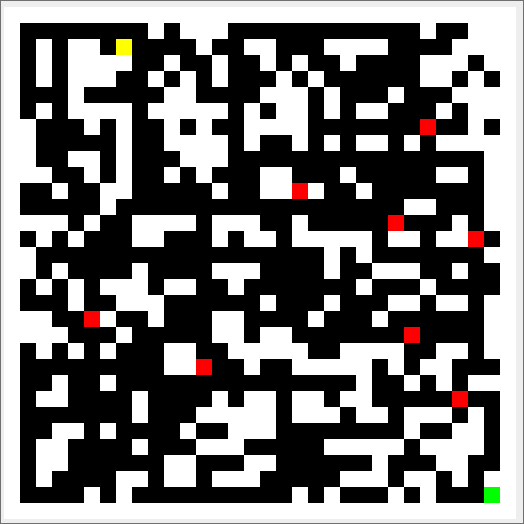

# retro-game

# Instructions:

(on Mars mips r2000 simulator)
unit width in pixels 16
unit height in pixels 16
display width in pixels 512
display height in pixels 512
base address for display 0x10010000

use WASD to move around

